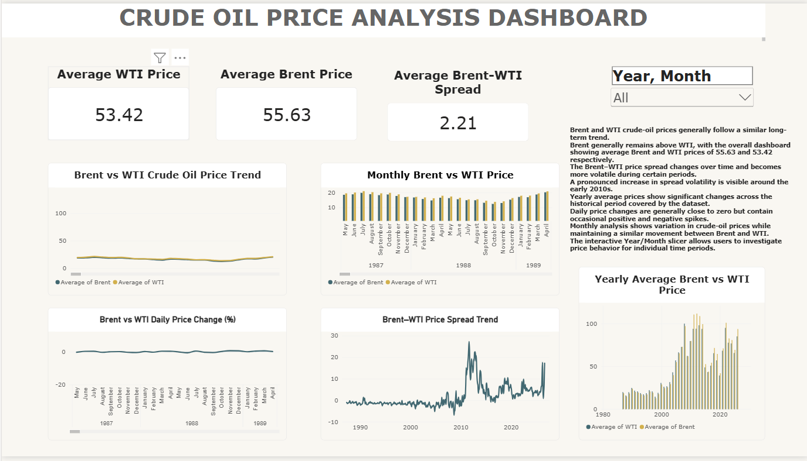
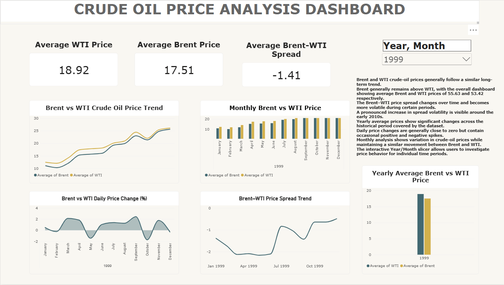
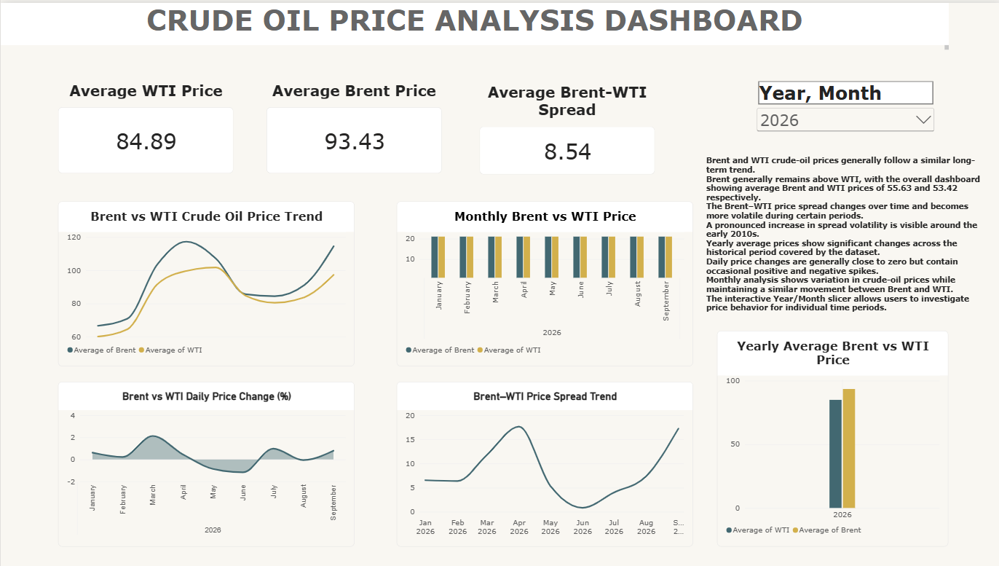
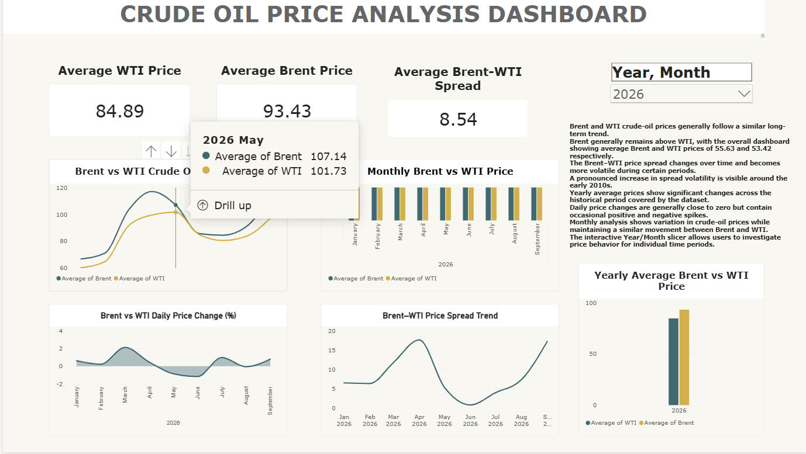

# Crude Oil Price Analysis Dashboard

An interactive **Power BI dashboard** for analyzing and comparing **Brent and WTI crude-oil prices** across historical time periods. The project combines data preparation, descriptive analysis, interactive filtering, KPI cards, trend analysis, monthly and yearly comparisons, daily price-change analysis, and Brent-WTI spread analysis.

## Project Overview

This project presents a visual analysis of crude-oil price behavior using historical Brent and WTI spot-price data. The dashboard is designed to make price trends and differences easy to explore through interactive Power BI visuals and Year/Month filtering.

> **Note:** The dashboard is descriptive. The observations presented in this project describe patterns in the supplied data and do not establish causal explanations for price movements.

## Objectives

- Analyze historical Brent and WTI crude-oil prices.
- Compare Brent and WTI price movements over time.
- Track the Brent-WTI price spread.
- Analyze monthly and yearly average prices.
- Examine daily percentage price changes.
- Provide interactive Year/Month filtering for focused analysis.
- Present the results through a clear and user-friendly Power BI dashboard.

## Tools & Technologies

- **Microsoft Power BI** — dashboard development and interactive visualization
- **Python / Google Colab** — data preparation and analysis
- **Excel / CSV** — data storage and processing

## Dashboard Components

The dashboard includes:

1. **Average WTI Price KPI**
2. **Average Brent Price KPI**
3. **Average Brent-WTI Spread KPI**
4. **Brent vs WTI Crude Oil Price Trend**
5. **Monthly Brent vs WTI Price Comparison**
6. **Brent vs WTI Daily Price Change (%)**
7. **Brent-WTI Price Spread Trend**
8. **Yearly Average Brent vs WTI Price Comparison**
9. **Interactive Year/Month Slicer**

## Key Dashboard Values

In the unfiltered dashboard view:

| KPI | Value |
|---|---:|
| Average WTI Price | 53.42 |
| Average Brent Price | 55.63 |
| Average Brent-WTI Spread | 2.21 |

## Key Observations

- Brent and WTI generally move in similar directions across the dashboard trend views.
- Brent is above WTI on average in the unfiltered dashboard view.
- The average Brent-WTI spread is **2.21**, but the spread varies over time.
- Daily percentage price changes are concentrated around zero, with larger positive and negative movements during selected periods.
- Monthly and yearly views show substantial variation in crude-oil prices across the historical period.
- The Year/Month slicer allows users to focus the dashboard on a selected period.

## Dataset

The repository contains the supplied historical crude-oil price data used for the dashboard, including:

- WTI Daily Spot Price data
- Brent Daily Spot Price data
- Raw Excel source files
- CSV datasets
- Cleaned crude-oil dataset

## Repository Contents

| File | Description |
|---|---|
| `Crude_Oil_Price_Analysis_Dashboard.pbix` | Power BI dashboard file |
| `WTI_Daily_Spot_Price_EIA.csv` | WTI historical price data |
| `WTI_Daily_Spot_Price_EIA_Raw.xls` | Raw WTI source data |
| `Brent_Daily_Spot_Price_EIA.csv` | Brent historical price data |
| `Brent_Daily_Spot_Price_EIA_Raw.xls` | Raw Brent source data |
| `Crude_Oil_Cleaned_Dataset.xlsx` | Cleaned dataset used for analysis |
| `Crude_Oil_Price_Analysis_Dashboard_Report.pdf` | Project report |
| `Crude_Oil_Price_Analysis_Dashboard_Description.txt` | Project description |
| `01_Dashboard_Default_View.png` | Default dashboard screenshot |
| `02_Dashboard_2026_Filter.png` | Dashboard with 2026 filter |
| `03_Dashboard_2026_Drilldown.png` | Dashboard drilldown screenshot |
| `04_Dashboard_1999_Filter.png` | Dashboard with 1999 filter |

## Dashboard Screenshots

### Default Dashboard View

### 2026 Filter View

### 2026 Drilldown View

### 1999 Filter View

## How to Use

1. Download or clone this repository.
2. Open `Crude_Oil_Price_Analysis_Dashboard.pbix` in Microsoft Power BI Desktop.
3. If Power BI requests a data source location, update the source path to the included dataset files.
4. Use the **Year/Month slicer** to explore different periods.
5. Review the KPI cards and charts to compare Brent and WTI prices, price changes, and spread behavior.

## Project Deliverables

- Power BI dashboard (`.pbix`)
- Cleaned dataset (`.xlsx`)
- Raw and CSV source datasets
- Dashboard screenshots
- Project report (`.pdf`)
- Project description (`.txt`)

## Author

**Utsav-113**

GitHub: [Utsav-113](https://github.com/Utsav-113)

## Repository

[Crude Oil Price Analysis Dashboard Project](https://github.com/Utsav-113/Crude-Oil-Price-Analysis-Dashboard-Project)
